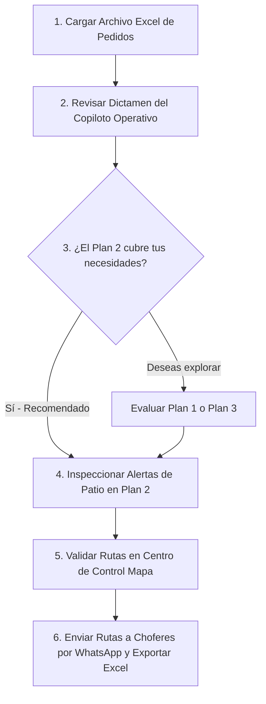

# MANUAL DE USUARIO
## Sistema de Optimización Logística, Ruteo y Despacho
### CISAALMA · Calidad Bueno (CEDI Fortín de las Flores, Veracruz)

---

## 📋 CONTENIDO DEL MANUAL
1. [Introducción y Objetivos del Sistema](#1-introducción-y-objetivos-del-sistema)
2. [Estructura del Archivo de Pedidos (Excel / SAP)](#2-estructura-del-archivo-de-pedidos-excel--sap)
3. [Flujo de Trabajo Operativo Diario (Paso a Paso)](#3-flujo-de-trabajo-operativo-diario-paso-a-paso)
4. [Guía de Pantallas y Funcionalidades](#4-guía-de-pantallas-y-funcionalidades)
   - [4.1 Barra Superior y Herramientas](#41-barra-superior-y-herramientas)
   - [4.2 Consola de Despacho (Visor Maestro de Embarques)](#42-consola-de-despacho-visor-maestro-de-embarques)
   - [4.3 Copiloto Operativo: Dictamen y Asesoría](#43-copiloto-operativo-dictamen-y-asesoría)
   - [4.4 Centro de Control (Mapa Interactivo y Telemetría)](#44-centro-de-control-mapa-interactivo-y-telemetría)
   - [4.5 Gestión de Pedidos Diferidos (Backorder)](#45-gestión-de-pedidos-diferidos-backorder)
5. [Criterios de Selección de Planes (Plan 1 vs Plan 2 vs Plan 3)](#5-criterios-de-selección-de-planes)
6. [Comunicación con Operadores vía WhatsApp](#6-comunicación-con-operadores-vía-whatsapp)
7. [Preguntas Frecuentes y Solución de Problemas](#7-preguntas-frecuentes-y-solución-de-problemas)
8. [Glosario de Términos Logísticos](#8-glosario-de-términos-logísticos)

---

## 1. INTRODUCCIÓN Y OBJETIVOS DEL SISTEMA

La plataforma **SaaS Logística & Ruteo CISAALMA** es una herramienta especializada en la planeación matemática, auditoría de carga y despacho de transporte para la distribución de abarrotes y bienes de consumo desde el CEDI central de Fortín de las Flores / Orizaba, Veracruz hacia toda la República Mexicana (Sureste, Centro, Bajío y Pacífico).

### Objetivos Principales:
* **Ahorro en Costo Directo de Flete**: Maximizar la consolidación de carga en camiones propios y permisionarios sin incurrir en viajes con unidades vacías ni fletes innecesarios.
* **Cumplimiento de Citas Comerciales (SLA)**: Garantizar que pedidos con citas críticas (ej. Walmart, Chedraui, Abarrotes Monterrey a las 07:00 AM) cuenten con rampa asegurada.
* **Viabilidad Física y Urbana**: Evitar el envío de Tráilers de 53 pies a centros históricos o cascos urbanos con calles estrechas (Puebla Centro, Cholula, Tehuacán, Cárdenas, etc.), asignando en su lugar Tortons y Camionetas.
* **Cumplimiento Normativo NOM-012-SCT**: Impedir sobrepesos que generen multas en básculas federales o daños mecánicos.
* **Comunicación Inmediata con Choferes**: Generación automática de hojas de ruta y despacho enviables directamente por WhatsApp con un solo clic.

---

## 2. ESTRUCTURA DEL ARCHIVO DE PEDIDOS (EXCEL / SAP)

El sistema procesa directamente las exportaciones de pedidos emitidas por SAP u hojas de cálculo en formato `.xlsx`, `.xls` o `.csv`.

```
[ ARCHIVO EXCEL DE SAP ] ──▶ [ LECTOR INTELIGENTE ] ──▶ [ MOTOR DE GEORREFERENCIACIÓN ] ──▶ [ 3 PLANES AUTOMÁTICOS ]
```

### Columnas Reconocidas Automáticamente por el Sistema:
| Campo Requerido / Opcional | Nombres de Encabezado Válidos en Excel | Función en el Sistema |
| :--- | :--- | :--- |
| **Identificador del Pedido** *(Obligatorio)* | `Pedido`, `Movimiento`, `ID_Pedido`, `Folio` | Identifica unívocamente la entrega. |
| **Cliente y Sucursal** *(Obligatorio)* | `Cliente`, `Sucursal`, `Nombre Cliente`, `Nombre Sucursal` | Razón social y nombre comercial de la tienda o CEDIS. |
| **Demanda / Peso (kg)** *(Obligatorio)* | `Peso`, `Kilos`, `Demand`, `Peso (kg)`, `Kg Factura` | Calcula el peso por parada y cubicaje total de la unidad. |
| **Destino Geográfico** | `Población`, `Ciudad`, `Estado`, `Dirección` | Determina el municipio y estado de entrega. |
| **Instrucciones / Notas** | `Observaciones 1`, `Observaciones 2`, `Referencia` | Crucial para identificar parques industriales, sucursales satélite (ej. Hunucmá, Tixcacal) y restricciones de entrega. |
| **Citas y Horarios** | `Hora Cita`, `Fecha Cita`, `Agente`, `Cita` | Programa la secuencia de paradas para cumplir ventanas horarias. |
| **Coordenadas GPS** *(Opcional)* | `Latitud`, `Longitud`, `Lat`, `Lng` | Coordenadas exactas en grados decimales (el sistema ignora automáticamente campos como "Colonia"). |

> [!TIP]
> **No requieres una plantilla rígida**: El motor lee el archivo dinámicamente reconociendo las cabeceras estándar de SAP, incluso si las columnas cambian de orden.

---

## 3. FLUJO DE TRABAJO OPERATIVO DIARIO (PASO A PASO)

Sigue este flujo de 6 pasos al iniciar tu turno de planeación y despacho:



### Paso 1: Cargar los Pedidos del Día
1. En la barra superior, haz clic en el botón **`📂 Pedidos`** o en el botón central **`Cargar Archivo Excel de Pedidos`**.
2. Selecciona el archivo de pedidos exportado de SAP (por ejemplo, `EJERCICIO_RUTAS_HOY.xlsx`).
3. En menos de 2 segundos, el sistema procesará todos los pedidos, validará su geolocalización al 100% y generará simultáneamente los 3 planes de despacho.

### Paso 2: Leer el Dictamen del Copiloto Operativo
1. El sistema se abrirá automáticamente en la **Consola de Despacho** con el **Plan 2 (Flota Balanceada)** seleccionado como estándar recomendado.
2. Lee el **Banner Horizontal de Asesoría**:
   - Verifica el número de fletes recomendados y el costo total global.
   - Revisa las alertas de *"Ojo de Patio"* para identificar camiones con múltiples paradas foráneas.

### Paso 3: Comparar Alternativas (Opcional)
* Si deseas comparar escenarios, haz clic en las pestañas superiores:
  * **Plan 1 (Máxima Consolidación)**: Para evaluar si puedes agrupar más carga en Tráilers pesados.
  * **Plan 3 (Nivel de Servicio & Citas)**: Para evaluar salidas ultra tempranas en camionetas pequeñas si un cliente exige entrega urgente.
* Si exploras otro plan, el copiloto te advertirá los riesgos (riesgo de maniobra en Plan 1 o sobrecosto en Plan 3) y te ofrecerá un botón directo: **`⭐ Activar Plan 2 Recomendado`**.

### Paso 4: Ajustes Finos Manuales (Si se requieren)
* Si requieres transferir un pedido de una unidad a otra, despliega la tarjeta del camión (`▼ X Pedidos`), haz clic en el icono de reasignación y selecciona el nuevo camión.
* Si un cliente canceló o pidió entrega para otro día, haz clic en **`Diferir`** para enviarlo a la bandeja de pedidos diferidos.

### Paso 5: Inspección en el Centro de Control (Mapa)
* Haz clic en **`🎯 Centro de Control`** o en el botón **`🗺️ Ver Mapa`** del banner para ver las rutas trazadas geográficamente en carreteras mexicanas con sus paradas numeradas secuencialmente.

### Paso 6: Despacho a Operadores y Exportación
1. Regresa a la **Consola de Despacho**.
2. Para cada camión confirmado, haz clic en **`📲 WhatsApp Chofer`** para enviar la hoja de ruta con teléfonos, direcciones y orden de descarga.
3. Haz clic en **`📊 Exportar Excel`** para descargar la programación oficial con el desglose de fletes y firmas de patio.

---

## 4. GUÍA DE PANTALLAS Y FUNCIONALIDADES

---

### 4.1 Barra Superior y Herramientas

Ubicada en la parte más alta de la pantalla, siempre accesible:

```
[ CISAALMA / CALIDAD BUENO ]  [ PLAN: Plan 2 ▾ ]  [ 🎯 Centro de Control ]  [ 📋 Consola Despacho ]  [ 📦 Diferidos: 0 ]  [ 🌙 Modo ]  [ 📂 Pedidos ]  [ 📊 Excel ]  [ 📄 CSV ]
```

* **Selector de Plan (`📋 PLAN: ...`)**: Menú desplegable para alternar en un clic entre Plan 1, Plan 2 y Plan 3.
* **`🎯 Centro de Control`**: Cambia a la vista de mapa satelital/carretero y telemetría de ruta.
* **`📋 Consola Despacho`**: Cambia a la vista de tarjetas maestras de embarque (ideal para el patio de maniobras).
* **`📦 Diferidos: X`**: Muestra cuántos pedidos están pausados o en backorder y permite gestionarlos.
* **`🌙 Modo`**: Alterna entre tema Claro (diurno para oficina) y tema Oscuro (diseñado para supervisión nocturna en patio sin fatiga visual).
* **`📂 Pedidos`**: Abre el selector de archivos para cargar un nuevo archivo Excel de pedidos.
* **`📊 Excel` / `📄 CSV`**: Descarga inmediata del plan activo en formatos editables.

---

### 4.2 Consola de Despacho (Visor Maestro de Embarques)

Es la pantalla de trabajo principal para la coordinación de patio. Se compone de tres secciones principales:

```
┌─────────────────────────────────────────────────────────────────────────────────────────────────┐
│ 1. TARJETAS DE KPIS GLOBALES (Carga Total | Fletes Activos | Costo Estimado | Citas SAP %)      │
├─────────────────────────────────────────────────────────────────────────────────────────────────┤
│ 2. BANNER HORIZONTAL DEL COPILOTO OPERATIVO (Dictamen, Razones Clave, Ojo de Patio y Acciones) │
├─────────────────────────────────────────────────────────────────────────────────────────────────┤
│ 3. CUADRÍCULA DE EMBARQUES (EMB-01, EMB-02, EMB-03, ...) - 100% alineados en columnas           │
└─────────────────────────────────────────────────────────────────────────────────────────────────┘
```

#### KPIs Globales:
* **CARGA TOTAL ASIGNADA**: Toneladas brutas del plan (ej. `360.36 t`) y porcentaje de pedidos programados.
* **TOTAL EMBARQUES / CAMIONES**: Número de viajes necesarios desglosados por tipo de vehículo (Tráilers, Tortons y Camionetas).
* **COSTO GLOBAL ESTIMADO**: Flete total estimado en moneda nacional y costo promedio por tonelada (`$ MXN / ton`).
* **CUMPLIMIENTO DE CITAS SAP**: Porcentaje de entregas con ventana horaria garantizada y citas puntuales.

---

### 4.3 Copiloto Operativo: Dictamen y Asesoría

El banner horizontal superior actúa como un asistente experto que traduce los algoritmos matemáticos a **criterios prácticos de patio mexicano**:

```
┌────────────────────────────────────────────────────────────────────────────────────────────────────────────────────────────────────────┐
│ 💡 DICTAMEN Y ASESORÍA DE DESPACHO PARA EL USUARIO  [Copiloto Operativo]     [⭐ PLAN 2 ACTIVO (RECOMENDADO)]  [🗺️ Ver Mapa] [📊 Excel] │
├─────────────────────────────────────┬─────────────────────────────────────┬────────────────────────────────────────────────────────────┤
│ COLUMNA 1: VEREDICTO                │ COLUMNA 2: FUNDAMENTOS CLAVE        │ COLUMNA 3: BLINDAJE & PATIO                                │
│ "Hola Usuario: Analizamos los 76    │ • Citas y CEDIS Protegidos: Walmart │ • Georreferenciación 100% Validada: Destinos satélite      │
│ pedidos. Tu mejor decisión es       │   y Monterrey en Tráiler FTL a 7am. │   (Hunucmá, Tixcacal, Canabal) corregidos sin desvíos.     │
│ confirmar este PLAN 2 (27 fletes,   │ • Maniobra Urbana Segura: Puebla,   │ • Control NOM-012: 100% unidades en peso de ley.           │
│ $443,403 MXN) sin atorones urbanos."│   Cholula y Cárdenas en Torton.     │ ⚠️ Ojo en EMB-03 (Torton): 4 paradas en Puebla. Validar    │
│ [NOM-012 OK] [27 Fletes en Plan 2]  │ • Ahorro Real: $70,674 frente a P3. │   tiempos de recibo para evitar arribo vespertino.         │
└─────────────────────────────────────┴─────────────────────────────────────┴────────────────────────────────────────────────────────────┘
```

#### Elementos Clave del Banner:
1. **Estado del Plan**:
   * Si estás en Plan 2: Muestra la insignia verde `⭐ PLAN 2 ACTIVO (RECOMENDADO)`.
   * Si estás en Plan 1 o 3: Muestra `ℹ️ EXPLORANDO PLAN X` y habilita un botón verde destacado `⭐ Activar Plan 2`.
2. **Fundamentos Operativos**: Explica con nombres y apellidos de clientes por qué esa distribución protege tus cuentas clave.
3. **Semáforo "Ojo de Patio"**: Detecta automáticamente unidades con 4 o más entregas foráneas y te avisa preventivamente si existe riesgo de retraso en la última parada.

---

### 4.4 Tarjetas de Embarque Individuales (`EMB-xx`)

Cada camión programado cuenta con una tarjeta independiente que contiene:

```
┌──────────────────────────────────────────────────────────────────┐
│  [EMB-03]   Torton_03 • TORTON 18T                         🟢    │
│  📍 Puebla Directo (Pq. Ind. 5 de Mayo)                          │
│                                                                  │
│            Carga: 17.94t / 18t [ 100% FTL ]                      │
│            [████████████████████████████████████]                │
│                                                                  │
│  ⏰ Salida CEDI: 5/Jun 05:00 AM   🏁 1ra Cita: 5/Jun 07:00 AM    │
│                                                                  │
│  [ 📲 WhatsApp Chofer ]   [ 🗺️ Mapa ]   [ ▼ 4 Pedidos ]          │
└──────────────────────────────────────────────────────────────────┘
```

* **Insignia de Unidad (`EMB-xx`)**: Identificador secuencial del flete.
* **Tipo de Unidad y Semáforo de Capacidad**:
  * 🟢 Verde: Ocupación óptima (75% a 100% FTL).
  * 🔵 Azul: Ocupación media (40% a 74% FTL).
  * 🔴 Rojo: Alerta de Sobrepeso que excede la capacidad máxima NOM-012.
* **Corredor Logístico**: Destino principal y región troncal de la ruta.
* **Tiempos de Patio**: Hora sugerida de salida del CEDI y hora estimada de llegada a la primera entrega.
* **Acciones Rápidas**:
  * `📲 WhatsApp Chofer`: Envía la ruta al operador.
  * `🗺️ Mapa`: Centra la ruta en el mapa satelital.
  * `▼ X Pedidos`: Despliega la tabla interna de pedidos con dirección, cliente, peso y botones de reasignación.

---

### 4.5 Centro de Control (Mapa Interactivo y Telemetría)

Al hacer clic en **`🎯 Centro de Control`**, accedes a la vista geográfica táctica:

```
┌──────────────────────────────────────┬────────────────────────────────────────────────────────┐
│ PANEL LATERAL DE CONTROL             │ MAPA NACIONAL INTERACTIVO (LEAFLET / OSM)               │
│                                      │                                                        │
│ • Carga: 360.36t   • 27 Fletes       │    📍 Toluca       📍 Puebla Directo                   │
│ • Costo: $443k     • Citas: 83% OK   │         \             /                                │
│                                      │          \     [CEDI FORTÍN]                           │
│ FILTROS:                             │                 /         \                            │
│ [Todos (27)] [Tractos (4)]           │        📍 Oaxaca           📍 Villahermosa             │
│ [Tortons (16)] [Camionetas (7)]      │                                  \                     │
│                                      │                                   📍 Tapachula / Mérida│
│ LISTA DE VIAJES:                     ├────────────────────────────────────────────────────────┤
│ ☑️ EMB-01 Camioneta 7t (Toluca)      │ HUD DE RENDIMIENTO SLA (En Vivo)                       │
│ ☑️ EMB-02 Camioneta 7t (Morelia)     │ • On-Time: 83%    • Ocupación FTL: 94%                 │
│ ☑️ EMB-03 Torton 18t (Puebla)        │ • Desvío Ruta: 0km • Holgura ETA: +45 min              │
└──────────────────────────────────────┴────────────────────────────────────────────────────────┘
```

* **Filtros Rápidos de Flota**: Permite aislar en el mapa únicamente los Tráilers, los Tortons o las Camionetas.
* **Visualización de Paradas**: Cada entrega se muestra como un marcador numerado según su orden de descarga. Al hacer clic sobre un marcador, se abre un cuadro con el cliente, peso y cita.
* **HUD de Telemetría (Esquina inferior derecha)**: Supervisa el cumplimiento de horarios, holgura de tiempo y porcentaje de llenado de las unidades. Puede minimizarse con el botón `✕`.

---

### 4.6 Gestión de Pedidos Diferidos (Backorder)

Si un cliente solicita mover su entrega o si decides posponer pedidos para completar un flete futuro:

1. En la Consola de Despacho, abre el detalle del camión (`▼ Pedidos`).
2. Haz clic en el botón naranja **`Diferir`** junto al pedido deseado.
3. El pedido se retirará de la ruta y el contador de la barra superior cambiará a **`📦 Diferidos: 1`**.
4. Haz clic en **`📦 Diferidos`** para abrir el panel de control:
   * Puedes ver la lista de órdenes retenidas y su peso acumulado.
   * Haz clic en **`Reintegrar`** para devolver el pedido a la planeación.
   * Haz clic en **`Reoptimizar Plan`** para recalcular automáticamente las rutas sin los pedidos diferidos.

---

## 5. CRITERIOS DE SELECCIÓN DE PLANES

El sistema calcula tres alternativas simultáneas. Utiliza esta tabla para decidir cuál emplear según la coyuntura del día:

| Criterio de Decisión | Plan 1: Máxima Consolidación | Plan 2: Flota Balanceada (ESTÁNDAR) | Plan 3: Nivel de Servicio |
| :--- | :---: | :---: | :---: |
| **Costo Global** | Menor en papel (\$371k) | **Óptimo (\$443k)** | Alto (\$514k) |
| **Número de Fletes** | 19 Fletes | **27 Fletes** | 38 Fletes |
| **Flota Empleada** | 8 Tráilers + 8 Tortons + 3 Camionetas | **4 Tráilers + 16 Tortons + 7 Camionetas** | 4 Tráilers + 8 Tortons + 26 Camionetas |
| **Tráilers en Zonas Urbanas** | ❌ **Riesgoso** (Puebla Centro, Cholula, Cárdenas) | ✅ **Cero Tráilers en centros urbanos** | ✅ Cero Tráilers en centros urbanos |
| **Citas a las 07:00 AM** | Cumple en papel, demora en calle | ✅ **Garantizadas en CEDIS directos** | Cumple atomizando flota |
| **Operación en Patio Fortín** | Carga lenta de tráilers | ✅ **Flujo continuo y ordenado** | ❌ **Colapso de andenes (38 unidades)** |
| **¿Cuándo usarlo?** | Solo si todos los clientes aceptan Tráiler y tienen andén. | **EL 95% DE LOS DÍAS DE OPERACIÓN NORMAL.** | Solo en emergencias comerciales de fin de mes. |

### La Regla de Oro del Despachador:
> **Utiliza siempre el Plan 2 como tu estándar base**. Proporciona el costo más bajo que es físicamente realizable en las carreteras y ciudades mexicanas, garantizando que tus operadores no sufran multas, atorones mecánicos ni rechazos en andén.

---

## 6. COMUNICACIÓN CON OPERADORES VÍA WHATSAPP

Para evitar que los choferes llamen constantemente preguntando por su ruta o se equivoquen de secuencia de entrega, la plataforma genera automáticamente el despacho digital:

### Cómo enviar la hoja de ruta al chofer:
1. En la tarjeta del camión (ej. `EMB-03`), haz clic en el botón verde **`📲 WhatsApp Chofer`**.
2. Se abrirá automáticamente una ventana de WhatsApp Web o tu aplicación de WhatsApp con un mensaje pre-estructurado como este:

```text
🚛 *DESPACHO DE EMBARQUE - CISAALMA / CALIDAD BUENO*
━━━━━━━━━━━━━━━━━━━━━━━━━━━
*Unidad:* EMB-03 (Torton 18T)
*Corredor:* Puebla Directo (Pq. Ind. 5 de Mayo)
*Carga Total:* 17.94 t (100% FTL)
*Salida CEDI:* 5/Jun 05:00 AM

📋 *SECUENCIA DE ENTREGAS:*
1️⃣ *Tehuacán* (ETA 07:00 AM)
   Cliente: CASIMIRO FRANCO ALATRISTE
   Dirección: NICOLAS BRAVO-TEHUACAN
   Peso: 10,000 kg

2️⃣ *Puebla* (ETA 10:13 AM)
   Cliente: NUEVA WAL MART DE MEXICO
   Dirección: SAN FRANCISCO TOTIMEHUACAN
   Peso: 365 kg

3️⃣ *Puebla PI 5 de Mayo* (ETA 11:30 AM)
   Cliente: PROVEEDORA DE ABARROTES RIVERA
   Dirección: PARQUE INDUSTRIAL 5 DE MAYO
   Peso: 4,500 kg

4️⃣ *San Pedro Cholula* (ETA 01:15 PM)
   Cliente: COMERCIALIZADORA XELHUA
   Dirección: CENTRO - CHOLULA
   Peso: 3,075 kg
━━━━━━━━━━━━━━━━━━━━━━━━━━━
⚠️ _Maneja con precaución y reporta cualquier novedad a Tráfico._
```

3. Simplemente escribe el número del operador o permisionario y presiona Enviar.

---

## 7. PREGUNTAS FRECUENTES Y SOLUCIÓN DE PROBLEMAS

### ¿Qué hago si al cargar mi Excel aparece una alerta de discrepancia de coordenadas?
El sistema cuenta con un **Auditor Geográfico Automático**. Si en el Excel la columna "Longitud" traía datos erróneos o si la dirección de un cliente satélite (ej. *Walmart Hunucmá*) fue confundida con el centro de Mérida, el sistema detecta la inconsistencia y **aplica automáticamente la coordenada real del catálogo de clientes**, ahorrando desvíos de hasta 70 km. No requieres modificar el archivo; el sistema lo resuelve por ti.

### ¿Por qué una tarjeta de camión muestra la barra de carga en rojo?
Si la barra de carga aparece en rojo con la advertencia `SOBREPESO NOM-012`, significa que los pedidos asignados a esa unidad superan la capacidad legal permitida por la Secretaría de Infraestructura, Comunicaciones y Transportes:
* Camioneta 4t: Máximo 4,000 kg.
* Camioneta 7t: Máximo 7,000 kg.
* Torton: Máximo 18,000 kg.
* Tráiler: Máximo 32,000 kg.
**Solución**: Abre los pedidos de esa unidad (`▼ Pedidos`) y transfiere uno de ellos a otra unidad con capacidad disponible o muévelo a Diferidos.

### Hice cambios manuales y quiero regresar a la planeación automática óptima, ¿cómo le hago?
En cuanto realizas una modificación manual, aparece un banner azul: *"AJUSTE MANUAL DE DESPACHO ACTIVO"*. Para revertir todos los movimientos y volver al cálculo algorítmico original, solo presiona el botón **`↺ Restaurar Plan Automático`**.

### ¿Puedo exportar el plan a Excel para imprimirlo en patio?
Sí. Haz clic en **`📊 Exportar Plan a Excel`** en el banner del copiloto o en la barra superior. El archivo descargado contiene 3 hojas de cálculo profesionales:
1. `RESUMEN_EMBARQUES`: Lista de camiones, placas, tipo de unidad, hora de salida, hora de regreso y costo.
2. `DETALLE_ENTREGAS`: Todas las paradas ordenadas cronológicamente con cliente, dirección, teléfono, peso y cita.
3. `KPIS_PLAN`: Resumen ejecutivo de costos, toneladas y cumplimiento de citas para archivo de Gerencia.

---

## 8. GLOSARIO DE TÉRMINOS LOGÍSTICOS

* **CEDI**: Centro de Distribución (en este caso, las instalaciones principales en Fortín de las Flores / Orizaba).
* **FTL (Full Truckload)**: Embarque con camión completo dedicado a un solo cliente o a una ruta exclusiva de alta densidad.
* **Torton (C3)**: Camión rígido de 3 ejes con capacidad útil de hasta 18 toneladas de carga. Ideal para maniobras urbanas y carreteras sinuosas.
* **Tractocamión / Tráiler (T3-S2)**: Unidad articulada con tractocamión y semirremolque de 53 pies con capacidad útil de hasta 32 toneladas.
* **NOM-012-SCT-2017**: Norma oficial mexicana que regula el peso y dimensiones máximas de los vehículos de autotransporte que transitan en las vías federales.
* **NOM-087-SCT-2017**: Norma oficial mexicana que establece los tiempos de conducción y pausas obligatorias para los conductores del autotransporte federal.
* **SLA (Service Level Agreement)**: Nivel de servicio pactado con el cliente, medido principalmente por el porcentaje de entregas puntuales en cita.
* **ETA (Estimated Time of Arrival)**: Hora estimada de llegada del camión a las instalaciones del cliente.
* **Backorder / Pedido Diferido**: Pedido que se pospone temporalmente para ser despachado en el siguiente ciclo o turno de carga.
